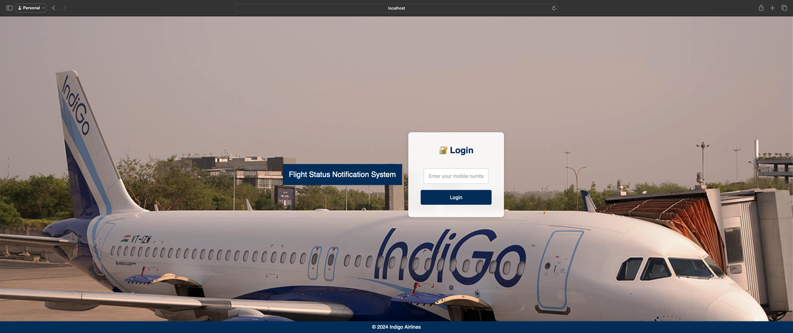

# 🛫 Flight Status Notification System

Welcome to the Flight Status Notification System project! This system provides real-time flight status updates via SMS, Email, and WhatsApp.

## 📋 Table of Contents

- [Project Overview](#project-overview)
- [Repositories](#repositories)
- [Presentation Slides](#presentation-slides)
- [Achievements](#achievements)
- [Setup Instructions](#setup-instructions)
- [How It Works](#how-it-works)
- [Screenshots](#screenshots)

## Project Overview 📄

The Flight Status Notification System consists of a backend and a frontend. The backend handles user authentication, flight details, and notification delivery. The frontend provides a user interface for managing flight notifications.

## 📁 Repositories

- [Backend Repository](https://github.com/Thakur-Prateek/flight-status-backend)
- [Frontend Repository](https://github.com/Thakur-Prateek/flight-status-frontend)

## 📊 Presentation Slides

Check out our [presentation slides](resources/Flight-Status-Notification.pdf) for a detailed overview of the project.

## 🏆 Achievements

- Real-time flight status updates using AviationStack API.
- Notification delivery via SMS, Email, and WhatsApp using Twilio and SendGrid.
- User-friendly interface for managing flight notifications.
- Seamless integration with PostgreSQL for user data and RabbitMQ for messaging.

## 🛠️ Setup Instructions

Please follow the setup instructions in the respective repositories to get the backend and frontend up and running:
- [Backend Setup Instructions](https://github.com/Thakur-Prateek/flight-status-backend/blob/main/SETUP.md)
- [Frontend Setup Instructions](https://github.com/Thakur-Prateek/flight-status-frontend/blob/main/SETUP.md)

## ⚙️ How It Works

The system is designed to provide real-time updates on flight status and manage user notifications effectively. For a detailed explanation, refer to:
- [Backend How It Works](https://github.com/Thakur-Prateek/flight-status-backend/blob/main/HOW_IT_WORKS.md)
- [Frontend How It Works](https://github.com/Thakur-Prateek/flight-status-frontend/blob/main/HOW_IT_WORKS.md)

## 📸 Screenshots

